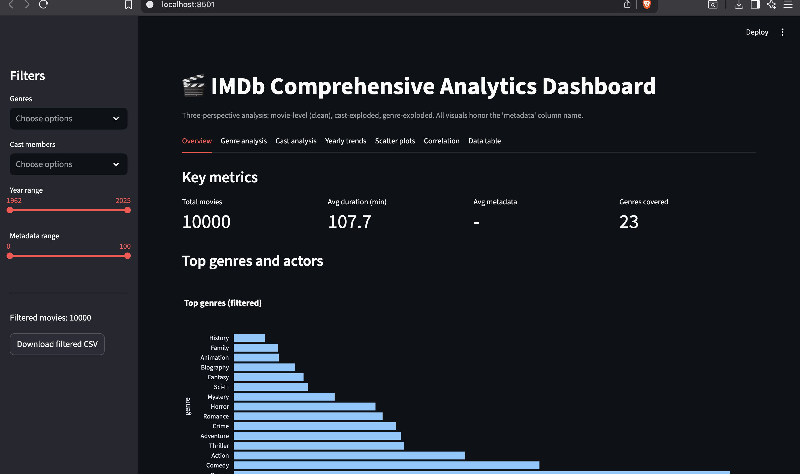
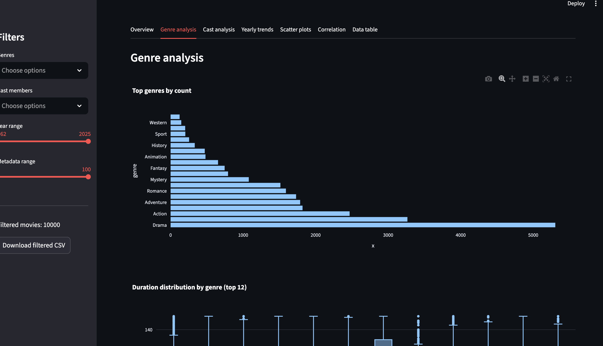
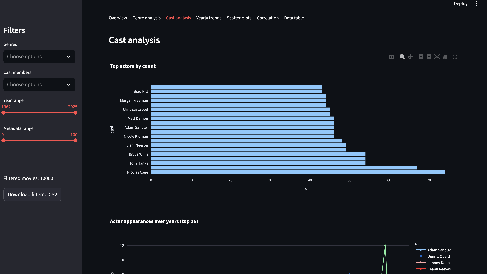
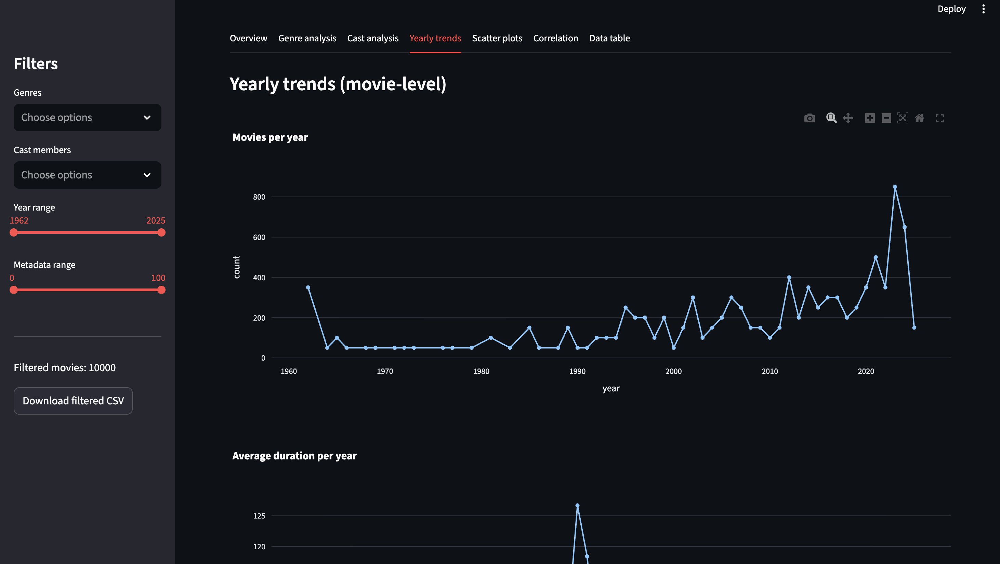
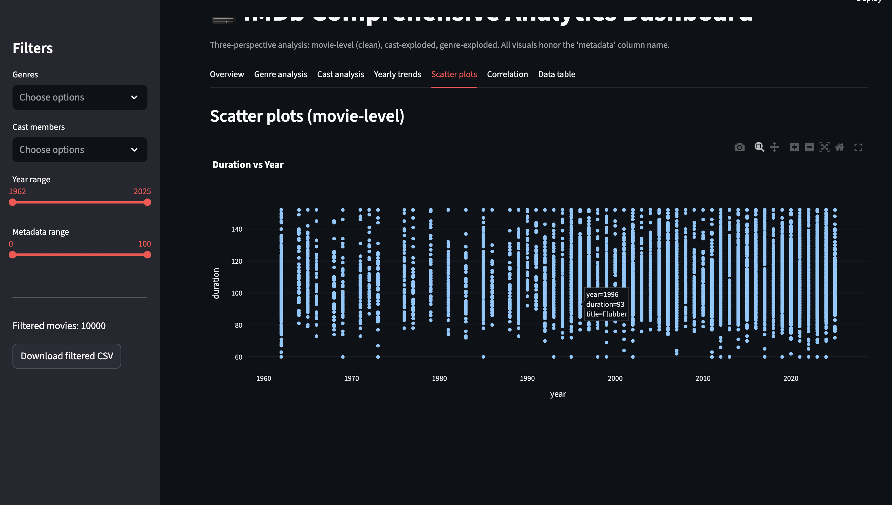
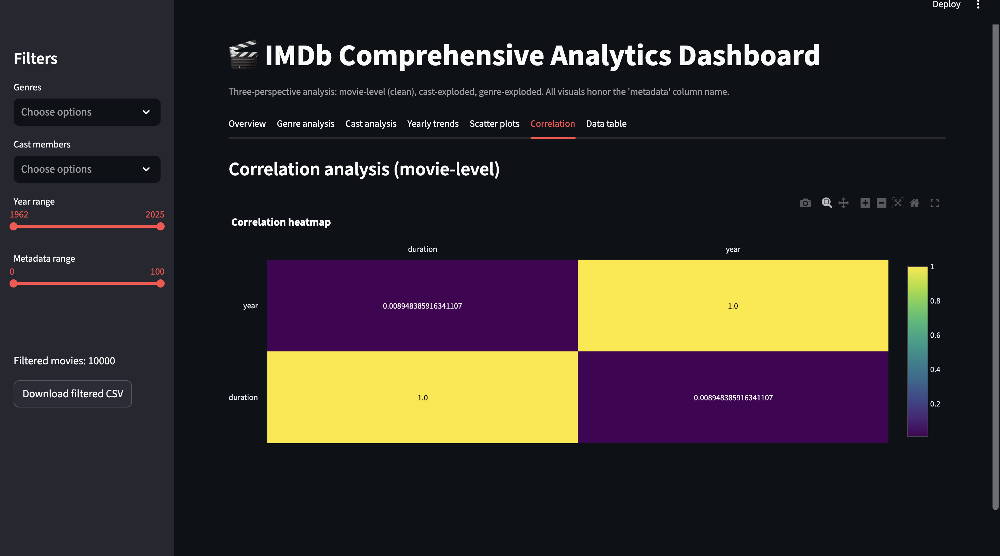
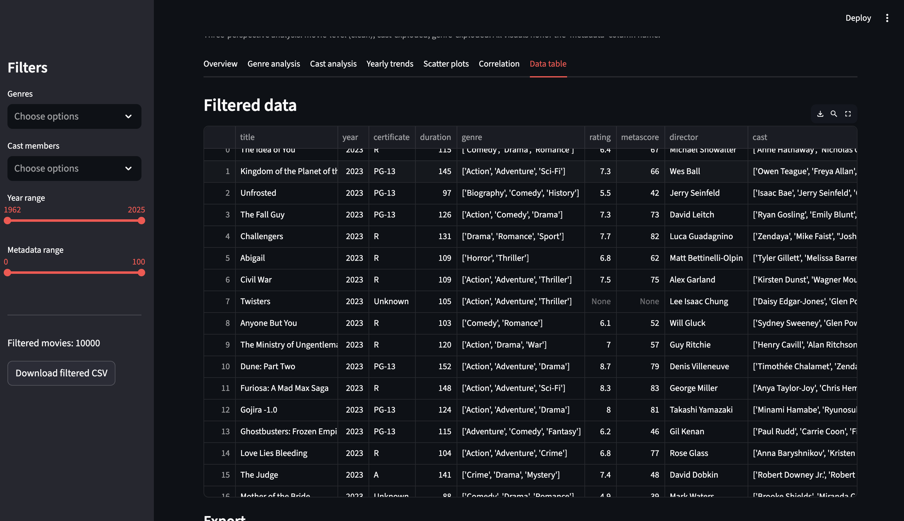

# 🎬 IMDb Comprehensive Analytics Dashboard

## 📖 Project Description
This project provides a **Streamlit-powered interactive dashboard** for analyzing IMDb movie data.  
It combines three datasets:
- **`imdb_clean.csv`** → cleaned movie-level dataset  
- **`imdb_cast_exploded.csv`** → exploded cast dataset (one row per actor)  
- **`imdb_genre_exploded.csv`** → exploded genre dataset (one row per genre)  

The dashboard delivers **multi-perspective insights** into movies, cast members, and genres, with interactive filters and polished Plotly charts.

---

## 📸 Dashboard Preview

### Overview


### Genre Analysis


### Cast Analysis


### Yearly Trends


### Scatter Plots


### Correlation Heatmap


### Data Table



*(Replace these image links with your own screenshots. Save them in an `assets/` folder in your repo.)*

---

## ✨ Features
- **Sidebar Filters**
  - Filter by genre(s), cast member(s), year range, and metadata score range.  
- **Overview Tab**
  - KPIs: total movies, average duration, average metadata score.  
  - Top genres and actors with bar and pie charts.  
- **Genre Analysis Tab**
  - Frequency of genres.  
  - Average metadata score per genre.  
  - Boxplots of duration and metadata by genre.  
  - Genre popularity heatmap over years.  
- **Cast Analysis Tab**
  - Most frequent actors.  
  - Average metadata score per actor.  
  - Boxplots of metadata by actor.  
  - Actor appearances trend over years.  
- **Yearly Trends Tab**
  - Movies per year.  
  - Average duration per year.  
  - Average metadata score per year.  
  - Genre popularity heatmap.  
- **Scatter Plots Tab**
  - Metadata vs Duration.  
  - Metadata vs Year.  
  - Duration vs Year.  
- **Correlation Tab**
  - Correlation heatmap of numeric features.  
- **Data Table Tab**
  - Interactive view of filtered data.  
  - Export filtered dataset as CSV.  

---

## ⚙️ Setup Instructions

### Step‑by‑Step Guide
```bash
# 1. Clone the repository
git clone https://github.com/bhanu2006-24/imbd-analysis.git
cd imdb-analysis

# 2. Create a virtual environment
python -m venv venv

# 3. Activate the environment
# On macOS/Linux
source venv/bin/activate
# On Windows
venv\Scripts\activate

# 4. Install dependencies
pip install -r requirements.txt

# 5. Run the dashboard
streamlit run dashboard.py
# imbd-analysis
